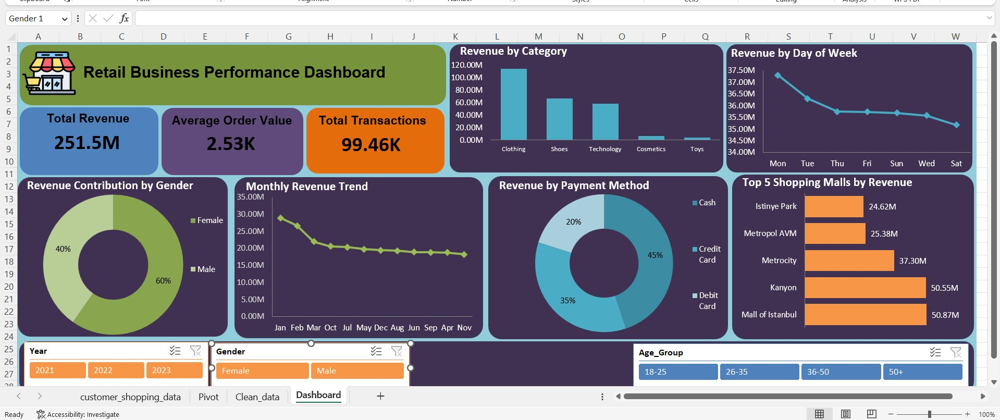
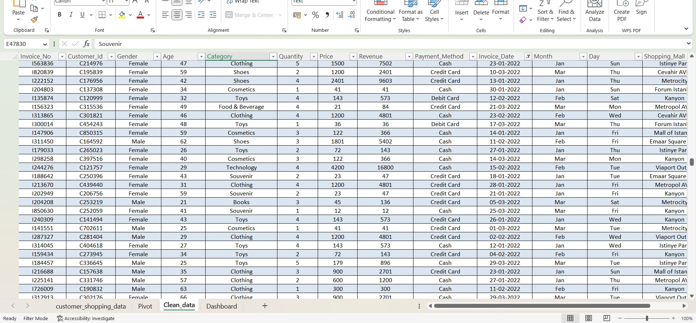
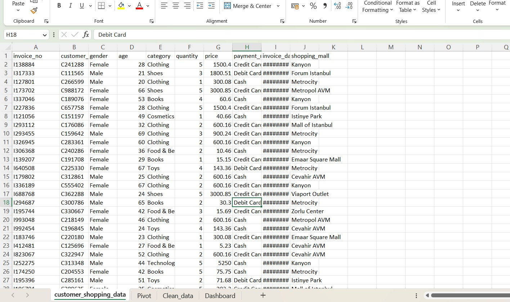

# 🛍️ Retail Sales & Customer Insights Dashboard | Excel

## 📌 Project Overview

This project analyzes retail sales data using **Microsoft Excel** to understand revenue drivers, customer segments, product performance, shopping-mall performance, payment behavior, and sales trends.
!
The goal was not just to build a dashboard, but to convert raw data into **clear business insights and actionable recommendations**.

---



## 🎯 Business Questions

- Which product categories generate the most revenue?
- Which customer segments are the most valuable?
- Which shopping malls perform best?
- Which payment method generates the most revenue?
- Which months perform best and worst?
- Does higher quantity always mean higher revenue?
- Where is revenue concentrated?
- What actions can improve business performance?

---

## 📊 Dataset

The dataset contains retail transaction-level information.

**Key columns:**

`Customer_Id` | `Gender` | `Age` | `Category` | `Quantity` | `Price` | `Revenue` | `Payment_Method` | `Invoice_Date` | `Month` | `Day` | `Shopping_Mall` | `Age_Group` | `Year`

---

## 🛠️ Tools & Skills

- Microsoft Excel
- Pivot Tables
- Pivot Charts
- Slicers & Filters
- KPI Analysis
- Customer Segmentation
- Revenue Analysis
- Trend Analysis
- Business Insights
- Dashboard Development

---

# 📈 Key KPIs

| KPI | Value |
|---|---:|
| **Total Revenue** | **₹251.51M** |
| **Customer ID Records** | **99.46K** |
| **Average Order Value (AOV)** | **₹2.53K** |

> **Note:** The dataset does not contain a separate Order ID, so the available Customer ID records were used for the transaction-level analysis and AOV calculation.

---

# 🔎 Key Business Insights

## 1. Revenue is highly concentrated in three categories

**Clothing:** ₹114.00M  
**Shoes:** ₹66.55M  
**Technology:** ₹57.86M

Together, these three categories generate approximately **95% of total revenue**.

### Business Meaning
The business depends heavily on these three categories.

### Recommendation
Prioritize inventory availability, demand forecasting, and performance monitoring for these categories.

---

## 2. High quantity does not always mean high revenue

Technology generated **₹57.86M** from only **15K units**, while Food & Beverage sold more than **44K units** but generated only **₹0.85M**.

### Business Meaning
Selling more units does not always mean generating more revenue.

### Recommendation
Evaluate products using both **quantity sold and revenue generated**, rather than volume alone.

---

## 3. Female customers are the largest revenue segment

| Gender | Revenue | Share |
|---|---:|---:|
| **Female** | **₹150.21M** | **59.72%** |
| Male | ₹101.30M | 40.28% |

### Business Meaning
Female customers contribute almost **60% of total revenue**.

### Recommendation
Use targeted offers, product recommendations, and loyalty strategies for high-value female customers.

---

## 4. Customers aged 36+ generate the majority of revenue

| Age Group | Revenue |
|---|---:|
| **50+** | **₹91.31M** |
| **36–50** | **₹74.20M** |
| 26–35 | ₹47.88M |
| 18–25 | ₹38.12M |

Customers aged **36+ contribute approximately 66% of total revenue**.

### Business Meaning
Older customer segments are currently the strongest revenue contributors.

### Recommendation
Develop targeted promotions and loyalty strategies for the 36+ customer segment.

---

## 5. Two shopping malls generate around 40% of revenue

| Shopping Mall | Revenue |
|---|---:|
| **Mall of Istanbul** | **₹50.87M** |
| **Kanyon** | **₹50.55M** |
| Metrocity | ₹37.30M |
| Metropol AVM | ₹25.38M |
| Istinye Park | ₹24.62M |

Mall of Istanbul and Kanyon together generate approximately **₹101.4M**, or around **40% of total revenue**.

### Business Meaning
Revenue is strongly concentrated in the top-performing locations.

### Recommendation
Maintain strong inventory and customer experience in these locations and identify successful practices that can be applied to lower-performing locations.

---

## 6. Clothing is the strongest category across major malls

The Mall × Category analysis shows that **Clothing is the leading revenue category across the major shopping malls**.

For example:

- Mall of Istanbul → Clothing: **₹22.95M**
- Kanyon → Clothing: **₹22.65M**
- Metrocity → Clothing: **₹17.23M**

### Recommendation
Monitor Clothing demand by location and ensure the right products are available at the right malls.

---

## 7. Cash is the largest revenue-generating payment method

| Payment Method | Revenue |
|---|---:|
| **Cash** | **₹112.83M** |
| Credit Card | ₹88.08M |
| Debit Card | ₹50.60M |

### Business Meaning
Cash is the largest payment method by revenue.

### Recommendation
Continue supporting cash payments while testing incentives that encourage digital payment adoption.

---

## 8. Revenue declined significantly from January to April

Monthly revenue was highest in **January at ₹28.89M** and declined to **₹18.72M in April**.

| Month | Revenue |
|---|---:|
| January | ₹28.89M |
| February | ₹26.63M |
| March | ₹21.96M |
| April | ₹18.72M |
| May | ₹19.72M |
| June | ₹18.93M |
| July | ₹20.38M |
| August | ₹19.28M |
| September | ₹18.80M |
| October | ₹20.55M |
| November | ₹18.21M |
| December | ₹19.46M |

### What I found

Revenue declined from **₹28.89M in January to ₹18.72M in April**, a decrease of approximately **35%**.

After April, revenue fluctuated rather than continuing to decline. There were recoveries in **May, July, and October**, showing that the decline was not continuous throughout the year.

### Business Meaning

The strong decline during the first four months suggests that the business should investigate what changed during this period.

Possible factors include:

- Product demand
- Customer mix
- Category performance
- Shopping-mall performance
- Promotions or seasonal effects

### Business Action

Management should compare **January–April performance** with later months to identify the main reasons behind the decline and determine which factors can be improved to stabilize revenue.

## 9. Revenue is relatively stable across weekdays

| Day | Revenue |
|---|---:|
| **Monday** | **₹37.30M** |
| Tuesday | ₹36.30M |
| Thursday | ₹35.74M |
| Friday | ₹35.73M |
| Sunday | ₹35.69M |
| Wednesday | ₹35.58M |
| Saturday | ₹35.18M |

### Business Meaning
Revenue is fairly evenly distributed across the week.

### Recommendation
Focus more on **category, customer, location, and monthly performance** rather than relying heavily on weekday performance.

---

## 10. 2021 and 2022 revenue remained stable

| Year | Revenue |
|---|---:|
| 2021 | ₹114.56M |
| 2022 | ₹115.44M |
| 2023 | ₹21.51M* |

\*2023 contains only **January–March data**.

Revenue increased by approximately **0.8% from 2021 to 2022**.

### Important Analyst Note

A full-year comparison between 2022 and 2023 would be misleading because 2023 contains only three months of data.

A better comparison would be:

**Q1 2022 vs Q1 2023**

---

# 💡 Business Improvement Opportunities

Based on the analysis, the main opportunities are:

### 1. Protect core revenue categories
Clothing, Shoes, and Technology generate approximately 95% of revenue.

**Action:** Prioritize inventory and demand forecasting for these categories.

### 2. Focus on high-value customers
Customers aged 36+ generate approximately 66% of revenue.

**Action:** Build targeted retention and loyalty strategies.

### 3. Strengthen top-performing locations
Mall of Istanbul and Kanyon generate around 40% of revenue.

**Action:** Maintain strong stock availability and study what drives their performance.

### 4. Improve customer targeting
Female customers contribute approximately 60% of revenue.

**Action:** Use customer segmentation for targeted marketing.

### 5. Evaluate revenue, not only volume
Some categories sell many units but generate low revenue.

**Action:** Measure both **quantity and revenue** when evaluating product performance.

### 6. Investigate monthly fluctuations
January performs significantly better than November.

**Action:** Analyze seasonality, promotions, customer mix, and category performance to understand the changes.

---

# 📊 Dashboard

The Excel dashboard provides an interactive view of:

- Total Revenue
- Average Order Value
- Revenue by Category
- Revenue by Gender
- Monthly Revenue Trend
- Revenue by Payment Method
- Revenue by Day of Week
- Top Shopping Malls by Revenue

### Interactive Filters

- Year
- Gender
- Age Group

These filters allow users to drill down into different customer segments and time periods.

---

# 🧠 Analytical Approach

```text
Raw Data
   ↓
Data Preparation
   ↓
Pivot Tables
   ↓
KPIs & Charts
   ↓
Identify Patterns
   ↓
Business Insights
   ↓
Business Recommendations
